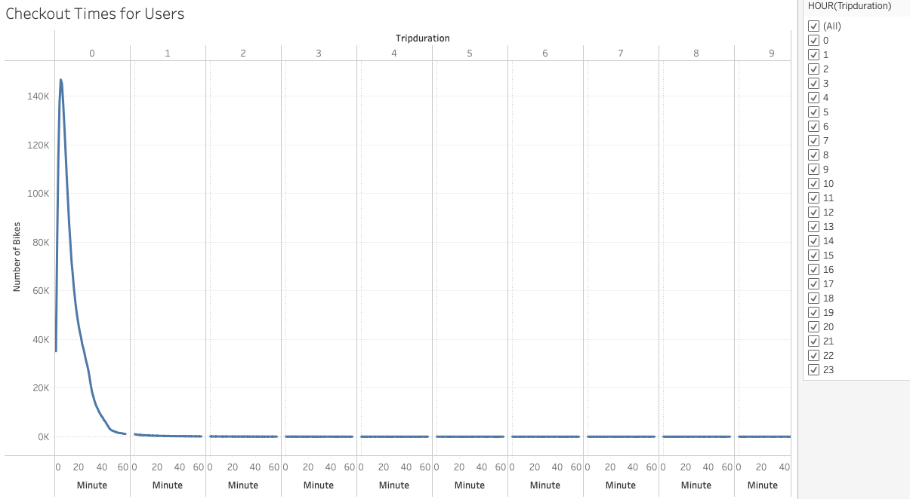
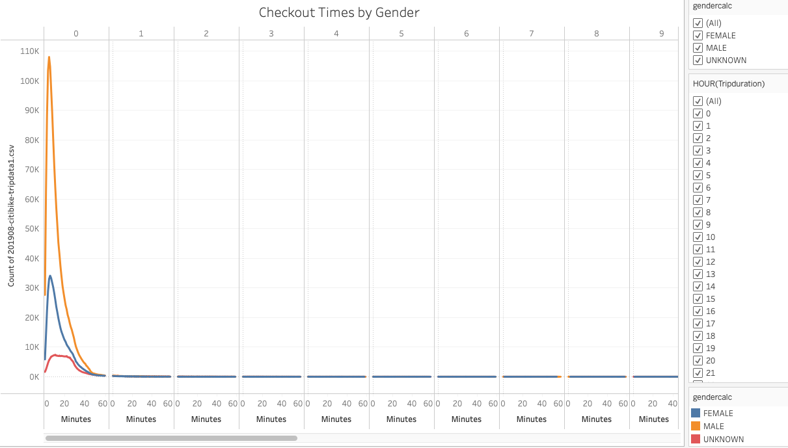
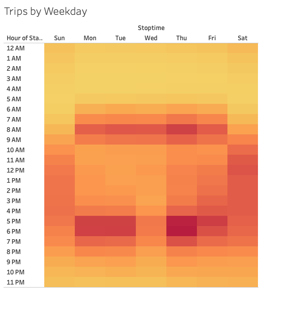
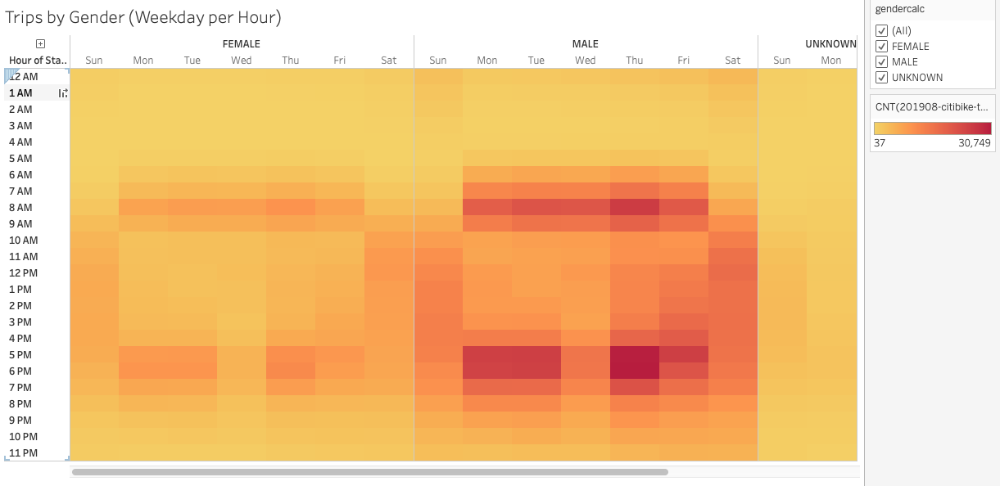
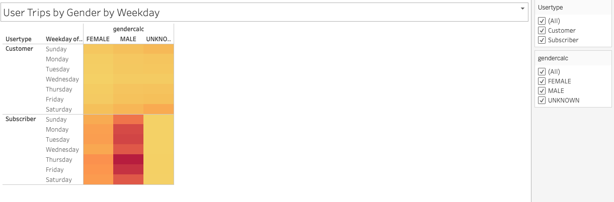
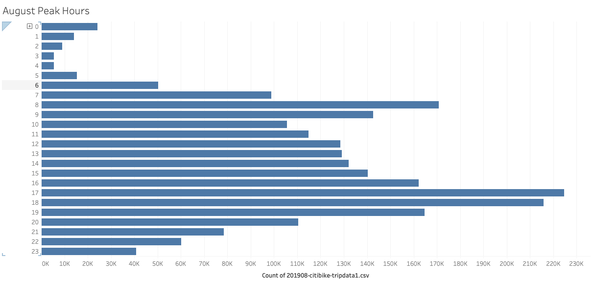
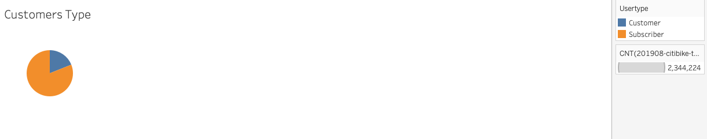
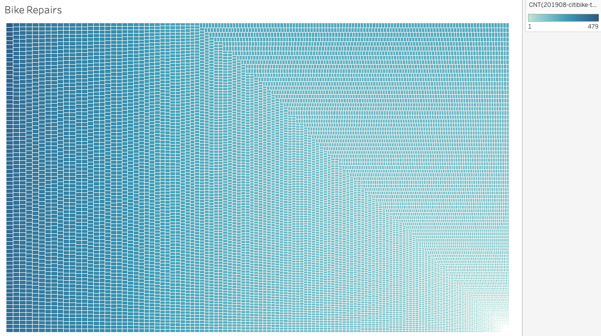

# Bike Sharing Des Moines 
--

### Determine if Des Moines would be a good fit for a bike sharing program [link to dashboard](https://github.com/jmarrujo31/bikesharing)
-

## Results

## Bike check out time

## Checkout Times by Gender

## Trips by Weekday

## Trips by Gender Weekday per Hour

## User Trips by Gender by Weekday

## August Peak Hours

## Customers Type

## Bike Repairs

# Summary

Provide a high-level summary of the results and two additional visualizations that you would perform with the given dataset.

